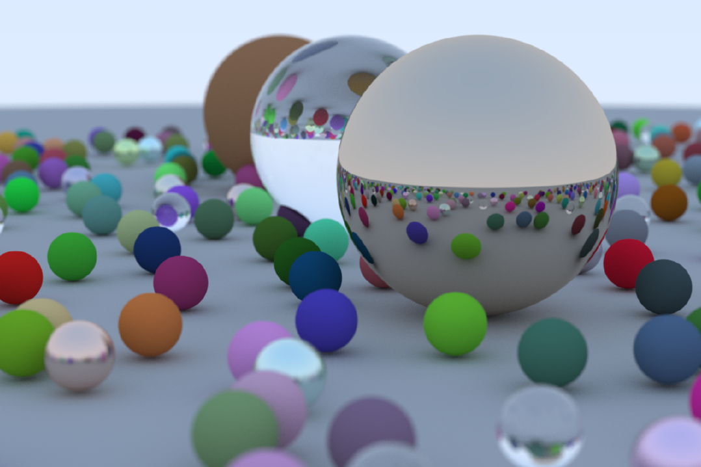

Liminal
=====

Liminal is a path tracer based on Peter Shirley's [Ray Tracing in One Weekend](https://raytracing.github.io/) series of books. Liminal currently implements the [first book](https://raytracing.github.io/books/RayTracingInOneWeekend.html) in its entirety.

### Coding style

I love this series of books! But the coding style is not for me. Before I move on to the [second book](https://raytracing.github.io/books/RayTracingTheNextWeek.html) I am doing a major refactor -- see the "roadmap" sections below.

(If you are here to get an idea for what my coding style is, please see [Skofnung](https://github.com/explodinggiraffes/skofnung) and [Exploding Giraffes](https://github.com/explodinggiraffes/exploding-giraffe-imgui)).

 #### Short term roadmap

- Consider splitting the `Material` classes into `.h` and `.cpp` files
- Making `SceneBuilder` more flexible; currently it can only build two scenes
- Moving hardcoded values from `Liminal.cpp` to a properties class; ideally values would be coming from a config file
- Try and break the dependency between `hittable.h` and `material.h`

#### Long term roadmap

- Concurrency
- UI, perhaps with being able to watch Liminal as it renders a scene

... or perhaps replacing this version of Liminal with one based on [pbrt](https://github.com/mmp/pbrt-v3) from [Physically Based Rendering](https://www.pbr-book.org/).
